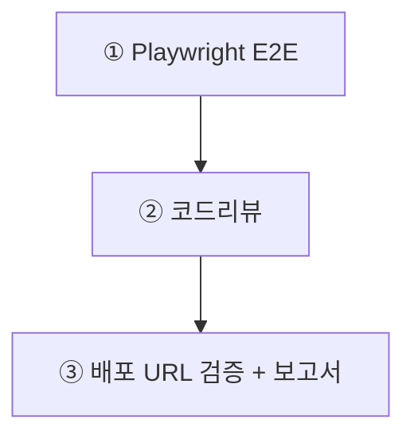

> **미션**: AI와 함께 만든 블로그가 실제로 안전하게 동작하는지 스스로 검증한다
> 

---

## 이 장의 흐름

Ch12까지의 빌드·보안 grep이 통과된 상태에서 시작한다. 이 장은 **E2E 테스트 자동화, 코드리뷰, 배포 URL 검증**을 추가한다. AI는 작성자가 아니라 검증 보조자로 사용한다.



| 단계 | 작업 | 절 |
| --- | --- | --- |
| ① | Playwright E2E 테스트 2개 | 13.1 |
| ② | AI 코드리뷰 | 13.2 |
| ③ | Vercel 배포 URL 검증 + 검증 보고서 | 13.3 |

> Playwright는 이 장에서 새로 설치한다. 나머지 앱 패키지는 Ch7·Ch8 기준 유지.
> 

---

## 학습목표

1. Playwright로 핵심 사용자 시나리오를 자동화할 수 있다
2. AI에게 코드리뷰를 요청할 때 관점과 우선순위를 지정할 수 있다
3. 로컬이 아닌 배포 URL에서 동작을 검증할 수 있다
4. 검증 결과를 보고서로 기록할 수 있다

---

## 13.1 Playwright E2E 테스트 `🤖 + ⌨️`

Playwright는 실제 브라우저를 자동 조작해 사용자 행동을 재현하는 도구다. 단위 테스트처럼 함수 하나만 보는 것이 아니라, 로그인 → 글 작성 → 목록 확인처럼 여러 화면이 이어지는 흐름을 자동으로 확인한다. 이 장에서는 **성공 경로 1개 + 거절 경로 1개**에 집중한다.

### 설치

```bash
npm init playwright@latest
```

| 질문 | 권장 답 |
| --- | --- |
| TypeScript 사용 | Yes |
| tests 폴더 | Yes |
| GitHub Actions 추가 | No |
| 브라우저 설치 | Yes |

### 테스트 작성 `🤖 바이브코딩`

```
Playwright E2E 테스트를 작성해줘.

파일: tests/auth-crud.spec.ts

테스트 1 — 행복 경로:
1. /login에서 TEST_EMAIL, TEST_PASSWORD 환경변수로 로그인
2. /posts/new에서 제목/내용 입력 후 저장
3. /posts 목록에서 새 글 제목 확인

테스트 2 — 거절 경로:
1. 로그아웃 또는 새 브라우저 컨텍스트
2. /posts/new 접속
3. /login으로 리다이렉트되는지 확인

규칙:
- 테스트 계정은 process.env 사용 (하드코딩 금지)
- 셀렉터는 getByRole, getByLabel 우선
- App Router 경로 기준
```

### 실행

```bash
npx playwright test
```

실패하면 바로 고치지 말고 재현 정보(테스트 이름, 실패 단계, 에러 메시지)를 정리한 뒤 원인을 파악한다.

---

## 13.2 코드리뷰 `🤖 바이브코딩`

Ch12에서 `git grep`으로 보안 키·구버전 API를 검사했다. 여기서는 grep으로 잡히지 않는 **로직·구조·데이터 흐름** 문제를 AI에게 맡긴다.

```
이 프로젝트의 최종 코드리뷰를 해줘.

관점: 보안 > 데이터 정확성 > 인증 > UX > 유지보수 순서로.
- RLS 우회 가능성, XSS
- posts/profiles 컬럼명 불일치, user_id 처리
- 세션 유지, 보호 라우트
- 로딩/빈 상태/에러 메시지
- 중복 코드, 구버전 API

심각도 높은 문제부터, 파일 경로와 함께 알려줘.
확인 필요한 건 "확인 필요"라고 표시해줘.
```

---

## 13.3 배포 검증·보고서 `⌨️ + 🤖`

### Vercel 배포 URL 검증

로컬에서 되는 것과 배포 URL에서 되는 것은 다르다. 환경변수 누락, Supabase URL Configuration 미등록 등은 배포에서만 드러난다.

```bash
vercel env ls
```

`NEXT_PUBLIC_SUPABASE_URL`, `NEXT_PUBLIC_SUPABASE_ANON_KEY`가 있는지 확인한다. 실제 값은 Vercel 대시보드(Project → Settings → Environment Variables)에서 눈으로 확인한다.

배포 URL을 열고 아래 시나리오를 확인한다.

| 시나리오 | 기대 결과 |
| --- | --- |
| 홈/목록 접속 | 정상 로드 |
| 로그인 | 성공 |
| 글 작성 | 성공 |
| 로그아웃 | 성공 |
| 비로그인 `/posts/new` | 로그인 페이지 이동 |
| 다른 사용자 글 수정/삭제 시도 | 실패 |

### 검증 보고서 `🤖 바이브코딩`

```
최종 검증 보고서를 작성해줘.

포함할 것:
1. 테스트 환경 (local / Vercel)
2. Playwright 테스트 결과
3. 배포 URL 수동 검증 결과
4. 아직 확인 필요한 항목

확인하지 않은 것은 절대 통과로 쓰지 말고 "확인 필요"라고 써줘.
context.md, todo.md도 함께 업데이트해줘.
```

---

## 흔한 AI 실수

| 실수 | 해결 |
| --- | --- |
| 확인 안 한 항목을 통과로 표시 | "확인 필요"로 남기기 |
| 행복 경로만 테스트 | 실패 경로 포함 |
| 테스트 계정 하드코딩 | 환경변수 사용 |
| 로그 없이 추측 | DevTools/Vercel logs 첨부 |
| 로컬만 확인 | 배포 URL에서 재검증 |

---

## 과제 스펙

1. Playwright 설치 + E2E 테스트 2개 (행복 경로 + 거절 경로)
2. AI 코드리뷰 실행 및 지적사항 수정
3. Vercel 배포 URL에서 핵심 시나리오 수동 검증
4. 검증 보고서 작성

### 제출 항목

1. GitHub 저장소 URL
2. Vercel 배포 URL
3. 검증 보고서 Markdown
4. Playwright 테스트 실행 결과 스크린샷 또는 로그